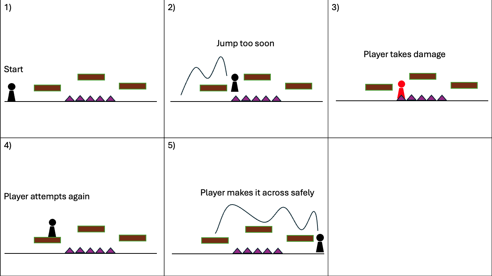
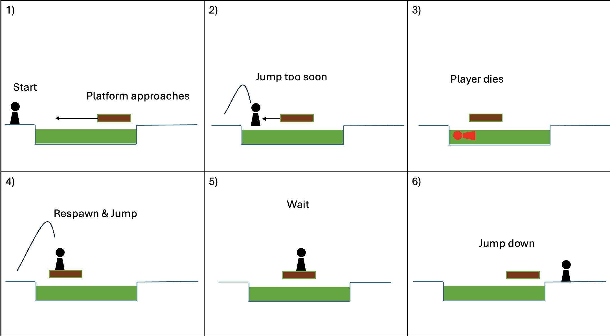
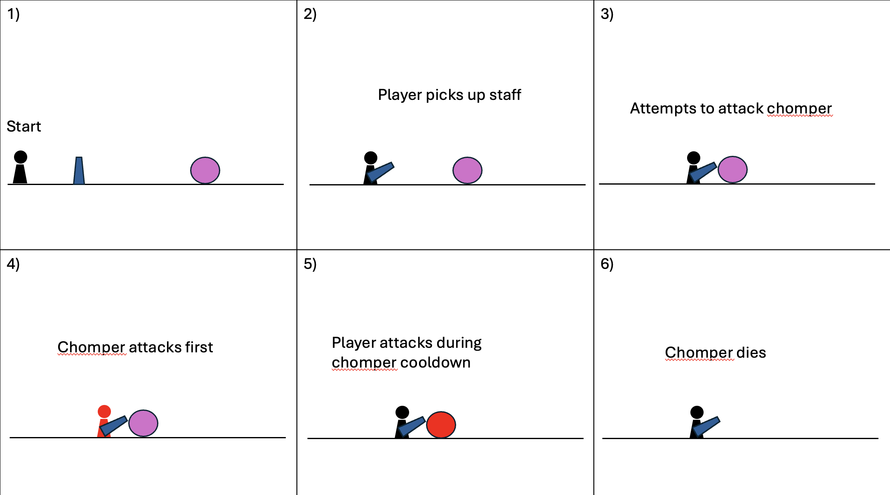
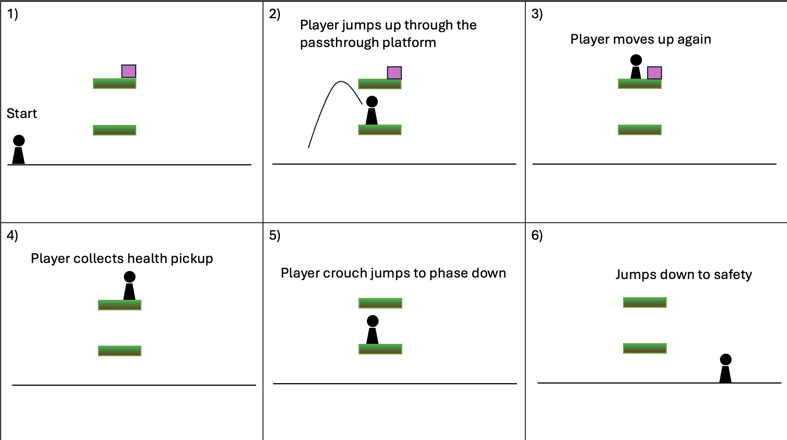
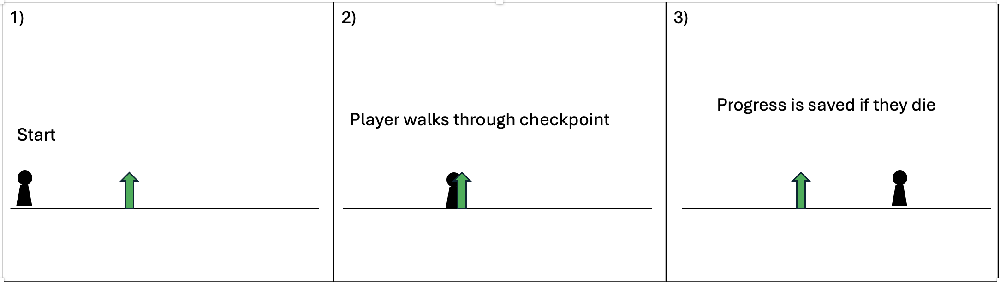
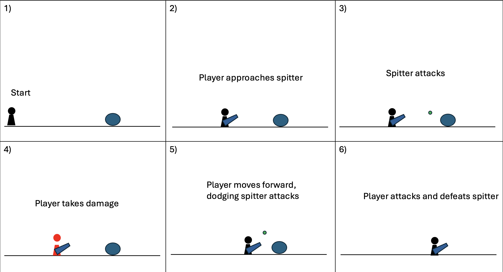
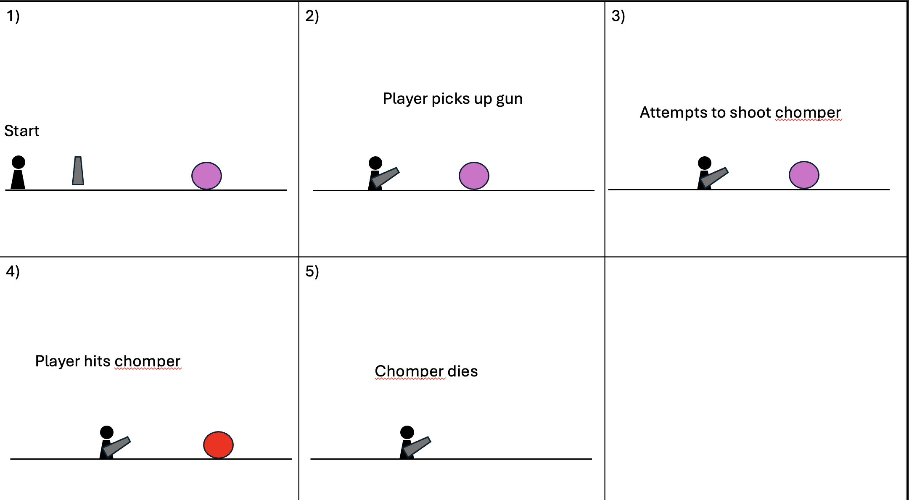
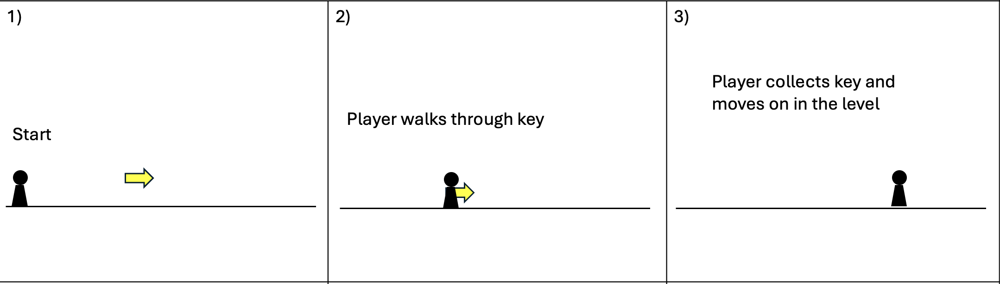

[](https://classroom.github.com/a/YyUO0xtt)
# COMP2150  - Level Design Document
### Name: Declan King
### Student number: 47414588

This document discusses and reflects on the design of your platformer level for the Level Design assessment. It should be 1500 words. Make sure you delete this and all other instructional text throughout the document before checking your word count prior to submission. Hint: You can check word count by copying this text into a Word or Google doc.

Your document must include images. To insert an image into your documentation, place it in the "DocImages" folder in this repo, then place the below text where you want the image to appear:

```

```

Example:


## 1. Player Experience (~700 words)

### 1.1. Discovery
Over the course of the first section/floor, the player learns the basics of the platformer and its mechanics that are required in order to complete the game. My level design incorporates good design practice through its gradual increase in difficulty and implementation of different/more challenging puzzles during a player's attempt at completing the level. As the player completes more and more sections of the level, they become more and more familiar with certain mechanics and the way things work, because of this the level increases in difficulty and encourages the player to continue learning different ways to go about completing the level. The design of my level also shows good design practice by having a clear narrative from the start with the player entering and exploring a cave that gets progressively more difficult the lower and further through the cave they get.

### 1.2. Drama
To show the intensity curve in my level, I utilised spikes in difficulty and also connective spaces where the player can rest for a bit before getting back into the fight. The difficulty spikes include having multiple enemies in the same space, a spawner that creates an enemy as soon as the last one was defeated, or difficult sections over acid or spikes that require precise timing to avoid falling and getting damaged. An example of a connective space within my level is after the player crosses two pits of acid, dodges spikes and a spitter, there is a small tunnel the player goes through, which leads them to a checkpoint and a health pickup giving the player a chance to rest and breathe before they move on to the next section.

### 1.3. Challenge
The biggest challenges in my level occur throughout the first section whilst the player is still getting familiar with the mechanics and controls of the game. However, as they progress through the level the difficulty does still have spikes and connective spaces in between to balance the challenges. Whilst the main challenges are at the beginning, there are some puzzles towards the end of the level which may challenge the player and their thinking. One of these puzzles includes opening a door, requiring them to shoot a switch, extending a bridge, allowing them to enter another room with enemies and another switch which will open the door, finally allowing the player through to the next area. After this difficult puzzle, there is a connective space including only a few enemies, however also includes a small parkour section using passthrough platforms up towards multiple health pickups as a reward for completing the puzzle.

### 1.4. Exploration
How does your level design facilitate autonomy and invite the player to explore? How do your aesthetic and layout choices create distinct and memorable spaces and/or places?
My level incentivises the player to explore through providing them with rewards for doing so. These rewards include health pickups and checkpoints which aid the player in their progression throughout the level. The design of my level creates distinct and memorable spaces by having a clear narrative the player moves through. At the beginning of the level, the player walks out and sees the pretty and colourful background, then as they move forward they enter a cave which the player goes deeper and deeper into with the enemies getting more and more prominent/difficult. From this, it is clear that as the cave gets deeper, the more difficult the level becomes. 

## 2. Core Gameplay (~400 words)
A section on Core Gameplay, where storyboards are used to outline how you introduce the player to each of the required gameplay elements in the first section of the game. Storyboards should follow the format provided in lectures.

Storyboards can be combined when multiple mechanics are introduced within a single encounter. Each section should include a sentence or two to briefly justify why you chose to introduce the mechanic/s to the player in that sequence.

You should restructure the headings below to match the order they appear in your level.

### 2.1. Spikes
Spikes were the first obstacle I chose to introduce to the player as it is a relatively easy obstacle, dealing minimum damage and allowing the player to move on without dying and an invincibility timer.
#### Storyboard


### 2.2. Acid + Moving Platforms
Due to acid killing the player, I thought it best to introduce it fairly early so they know this feature and be more cautious around it in the future. The added moving platforms help the player easily cross the acid.
#### Storyboard


### 2.3. Weapon Pickup (Staff) + Chompers
After the player crosses the acid, they are given the staff as a weapon to fight enemies and destroy particular walls. The player is then confronted with a chomper on a platform, depending on the chomper's position, the chomper will attack and stop the player from reaching the platform, causing them to lose health and fall down. The player can then try again during the chomper's attack cooldown and hopefully be successful in defeating the chomper.
#### Storyboard


### 2.4. Passthrough Platforms + Health Pickups
After defeating the chomper, the player can jump up through a passthrough platform towards a health pickup. Through exploration, the player finds this hidden health bonus and is rewarded for their curiosity, and therefore is encouraged to explore and be curious more often as there is an incentive for this.
#### Storyboard


### 2.5. Checkpoints
A checkpoint is then introduced, giving the player a chance to respawn if they were to die between here and the next checkpoint. I decided to place the checkpoint here due to the next challenge of moving platforms + acid + a new enemy. This challenge could be difficult for players so by having a checkpoint in this location they won't have to repeat all the stuff they might have mastered by now.
#### Storyboard


### 2.6. Spitters
I decided to introduce a spitter in this location to give the player a greater challenge crossing the acid. If the challenge was to cross the acid without any extra difficulty, it would be the same as my introduction to those mechanics, so by adding the spitter, it becomes more difficult than the original introduction.
#### Storyboard


### 2.7. Weapon Pickup (Gun)
The introduction of the gun pickup here is a way to show the player that firstly, they can figure out how to shoot their weapon before an enemy confronts them, and secondly, so they learn they can shoot the gun whilst crouching which may be helpful in future sections.
#### Storyboard


### 2.8. Keys
The key is introduced to the player once they have gotten to the end of the 'first floor' as a reward for completing it and are then encouraged to move on further into the cave. 
#### Storyboard


## 3. Spatiotemporal Design
A section on Spatiotemporal Design, which includes your molecule diagram and annotated level maps (one for each main section of your level). These diagrams may be made digitally or by hand, but must not be created from screenshots of your game. The annotated level maps should show the structure you intend to build, included game elements, and the path the player is expected to take through the level. Examples of these diagrams are included in the level design lectures.

No additional words are necessary for this section (any words should only be within your images/diagrams).
 
### 3.1. Molecule Diagram

### 3.2. Level Map – Section 1

### 3.3.	Level Map – Section 2

### 3.4.	Level Map – Section 3

## 4. Iterative Design (~400 words)
Reflect on how iterative design helped to improve your level. Additional prototypes and design artefacts should be included to demonstrate that you followed an iterative design process (e.g. pictures of paper prototypes, early grey-boxed maps, additional storyboards of later gameplay sequences, etc.). You can also use this section to justify design changes made in Unity after you drew your level design maps shown in section 3. 

You should conclude by highlighting a specific example of an encounter, or another aspect of your level design, that could be improved through further iterative design.

## Generative AI Use Acknowledgement

Use the below table to indicate any Generative AI or writing assistance tools used in creating your document. Please be honest and thorough in your reporting, as this will allow us to give you the marks you have earnt. Place any drafts or other evidence inside this repository. This form and related evidence do not count to your word count.
An example has been included. Please replace this with any actual tools, and add more as necessary.


### Tool Used: ChatGPT
**Nature of Use** Finding relevant design theory.

**Evidence Attached?** Screenshot of ChatGPT conversation included in the folder "GenAI" in this repo.

**Additional Notes:** I used ChatGPT to try and find some more relevant design theory that I could apply to my game. After googling them, however, I found most of them were inaccurate, and some didn't exist. One theory mentioned, however, was useful, and I've incorporated it into my work.

### Tool Used: Example
**Nature of Use** Example Text

**Evidence Attached?** Example Text

**Additional Notes:** Example Text


